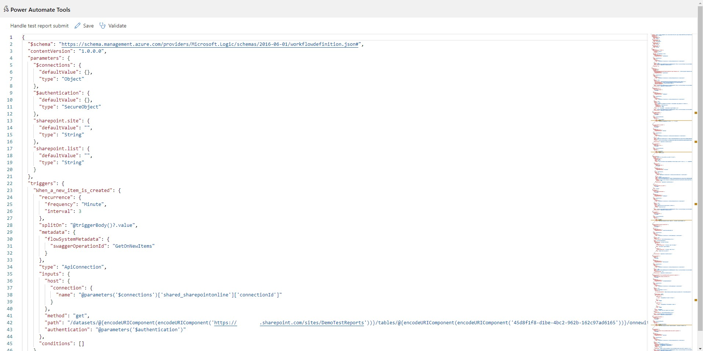

# Power Automate Tools Extension

The Chrome/Edge extension enables editing a Power Automate flow definition as JSON.

## Motivation

The reason behind creating this extension is constantly struggling with repetitive tasks in the flow authoring workflow like replacing a SharePoint site's URL or changing the variable name.

## Features

- Edit a Power Automate flow as JSON in your browser.
- Workflow definition JSON schema validation.
- Rich text manipulation features thanks to [Monaco Editor (VS Code)](https://microsoft.github.io/monaco-editor/).
- Validating actions using "Flow Checker".
- More features may come in the future :)

## Getting started

1. Get the extension from the [Chrome extensions store](https://chrome.google.com/webstore/detail/power-automate-tools/jccblbmcghkddifenlocnjfmeemjeacc) or [Edge Add-ons](https://microsoftedge.microsoft.com/addons/detail/power-automate-tools/ecdclfoojhebjoknjoooljcakfbfpjoj)
2. Open the flow edit page in the Power Automate portal.
3. Click the extension icon.
4. Edit your flow!

## Change Log

### v1.2
- Fixed the issue of saving a flow
- Support for launching from the new Power Automate designer
- Improved launching from the Power Apps Portal
- Now the editor allows to edit the flow definition and connection references

### v1.1

Added support for opening a flow from the new Power Automate portal and Power Apps portal.
## Known limitations

- The authentication token is not refreshed automatically at this moment. Sometimes might be necessary to refresh the flow page that was used to open the extension.
